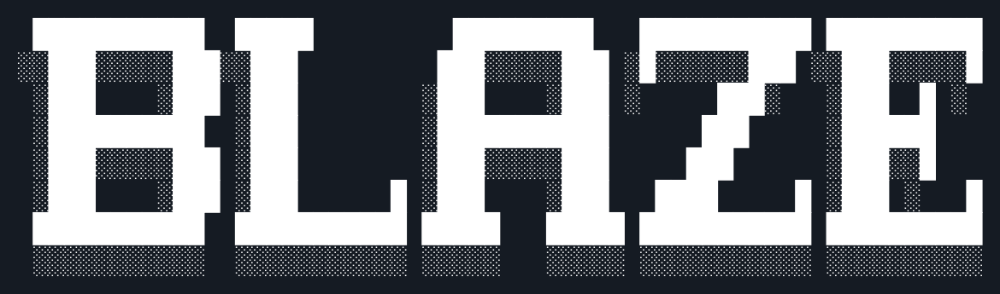

> [!NOTE]
> The features described below are likely not implemented yet as this project is still in active
> development!



BLAZE is a minimal UNIX-like operating system targeting x86_64 architecture. It is partially based
on [Nix](https://nixos.org/) and nixpkgs to ensure the system is reproducible and declarative.

## Building from source
Prerequisites:
+ [Rust](https://rust-lang.org/) (`cargo` and `rustc`)
+ [Limine 12.9.0 binary release](https://github.com/limine-bootloader/Limine/releases/tag/v12.9.0)
+ [xorriso](https://www.gnu.org/software/xorriso/)
+ [QEMU](https://www.qemu.org/)

Extract the Limine binary release and enter the extracted directory. Build the host utility:
```sh
make
```
Copy the resulting `limine` executable into the `bootloader/limine` directory.
Clone the repository and run the build script:
```sh
git clone https://github.com/TheBananaPancake/BLAZE.git
cd BLAZE
./build.sh
```
To test your changes, it is recommended to run the ISO in
a virtual machine. Run it in QEMU:
```sh
qemu-system-x86_64 -cdrom blaze-x86_64.iso
```
